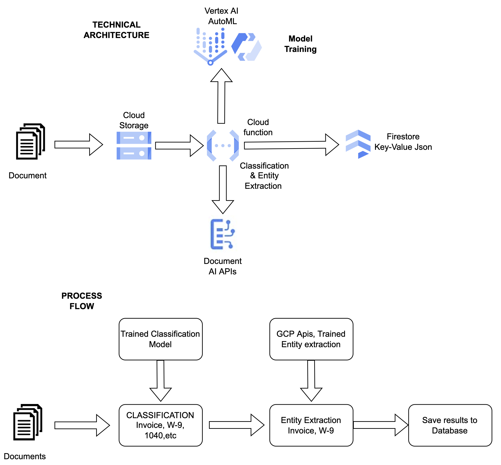

# Document Intelligence Sales Demo (DISD)
The DISD project is an internal Maven Wave resource that can be used to demonstrate our proficiency in the intelligent document processing space.

## Project Resources
You may need to request access to these resources.

* [Demo Runbook](https://docs.google.com/document/d/1wVuUB9oPptj9kFrZD5Q9c88HvtXQYDAdlUsBeXsptFU/edit?usp=sharing)
* [Demo Video Walkthrough](https://drive.google.com/file/d/1LD0rnAfTQtgrNKkfjtqopTWadmqT-IG4/view?usp=sharing)
* [GCP Project (ID: mwpmltr)](https://console.cloud.google.com/welcome?project=mwpmltr)

## Components

### Architecture Diagram

### Summary

* *pipelines* - Kubeflow Pipelines are deployed on Vertex AI to train the model and upload the resulting artifact to Google Cloud Storage.
* *cloud_function* - A Cloud Function is used in the event-driven system to run inference on incoming documents. The Cloud Function references the model artifact uploaded by the Kubeflow Pipeline.
* *notebooks* - In addition to running inference via the event-driven cloud architecture, you can also run inference on documents from the notebooks contained in the notebooks subdirectory

## Setup
Each component of the project is managed independently. Follow the instructions in the subdirectory READMEs to establish your development environment for a particular component.

## Contributing
Pull requests are welcome as long as you follow these practices

* Tag [Claire Salling](claire.salling@mavenwave.com) as a reviewer
* Limit any PR you submit to 250 lines of code or less
* For major changes, please open an issue first to discuss the changes you would like to make

## Authors

* **Rohit Gupta** - Data Scientist - rohit.gupta@mavenwave.com
* **Claire Salling** - Data Scientist/Document Intelligence Solution Owner - claire.salling@mavenwave.com